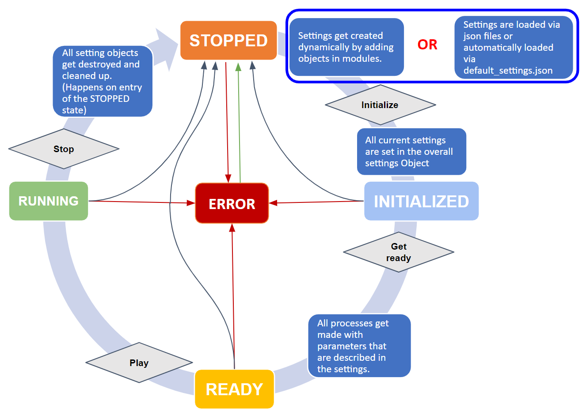
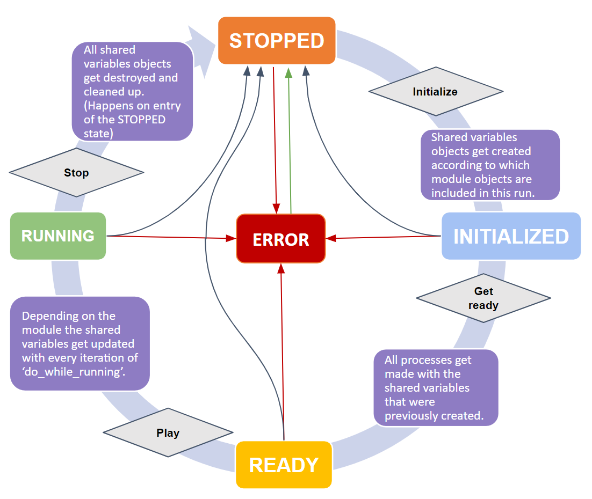

# JOAN Overview

In this section, we try to explain the overall high-level structure of the JOAN framework. Please note that if you are interested
in adding your own modules you need a more thorough understanding than just this section, if that is the case, please
also consult the [Advanced Steps Section](advanced-add-custom-module.md) for more information.

## High-Level JOAN Structure
{target="_blank"}

In the image above you'll notice that JOAN consists mainly of 2 groups, namely the `core` and the `modules`. For now
 we'll leave the core be, however, we will go into the modules here. 

## Module
A module executes a certain function, like recording data or communicating with CARLA. The modules are set up to run in their own process (using the `multiprocessing` toolbox) to distribute the computational load. For more info on how we set up multiprocessing in JOAN, check out below.

Modules can be anything you want because as it says in the name already JOAN has a modular structure. It is important to know what exactly is contained in a
JOAN Module, this is summarized in the image below:
{target="_blank"}

The descriptions in the above image are of course a very short summary, for a deeper understanding of what each element
does, and a bit more context please refer to the following explanations:

- [Module Manager](advanced-add-custom-module.md#manager_class){target="_blank"}
- [Module Dialog](advanced-add-custom-module.md#dialog_class){target="_blank"}
- [Module Settings](advanced-add-custom-module.md#settings_class){target="_blank"}
- [Module Shared Variables](advanced-add-custom-module.md#shared_variables_class){target="_blank"}
- [Module Process](advanced-add-custom-module.md#process_class){target="_blank"}

## Data flow & Communication

Because of multiprocessing and the modular structure of JOAN the data flow can be a bit difficult to grasp. In this section, we try to shed some light on these topics. A graphic overview is given in the image below, this image is an arbitrary example where we use 2 separate modules, `module 1` and `module 2`.
{target="_blank"}
Please keep the above image in mind when going through the text below, there we will explain the flow of data and JOAN in more detail.

### States

The first thing you'll notice is that we have 4 columns of almost the same thing, these represent the different states
JOAN can be in during expected operation; `STOPPED`, `IDLE`, `READY` and `RUNNING`. This is important because it will give you more insight
into when, how, and why certain communication elements are used. 

### Settings

As mentioned earlier every module has its own settings. These settings are made whenever a module is loaded and stored in the `Settings()` class. 
Loading a module means nothing more than including the module in the main.py of the program via the headquarters. Whenever you have a module loaded it will
have a settings object associated with it, this settings object can get filled with different other setting objects, for example, the
hardware manager module has a base settings object for the module: `HardwareManagerSettings()`, but inside this object, we have a dictionary
called `inputs` which contains the setting objects of different types of inputs. For example, it can contain a 
`KeyboardSettings()` object and 2 `JoystickSettings()` objects. These specific settings objects are dynamically created and destroyed depending on the state of the module. The way
it goes is as depicted below:

{target="_blank"}

### Shared Variables

The `Shared Variables` is one of the most essential classes of JOAN. As with the `Settings()` the creation and removal of these classes
depend on the States as shown below:

{target="_blank"}

!!! Important
    Shared Variables have to be picklable (serializable)!!

### Signals

The Signals class in the Default JOAN is a bit obscure, so far it is only used in the `activate condition` function in the 
experiment manager. This triggers signals so that whenever a condition is activated it updates all dialogs of all included modules.
The Signals class uses the built-in signals & slots functionality from PyQt, so for a deeper understanding please refer to [this 
tutorial on signals and slots](https://www.tutorialspoint.com/pyqt/pyqt_signals_and_slots.htm){target="_blank"}

### News

The `News()` class is used throughout all modules and serves as a sort of message pipe to all modules. It mainly contains the separate `shared_variables` objects
of all the modules. This is needed because then we can access our shared variables from all modules. For example, if I'd like to calculate something in a separate
`calculator` module, and for this, I need the input values of a `keyboard` from the `hardwaremanager` I can easily access this info in my new module! 

### Modules multiprocessing

JOAN modules are set up to run in their own process using the `multiprocessing` toolbox. In short, this means that each module will create its own process and communicates with that process once the user hits the "Get ready" and "Run" buttons. The module's functionality (everything that happens in `do_while_running(self)`) is then executed in a separate process. Communicating with a different process is not trivial, and we encourage you to check out the [multiprocessing documentation](https://docs.python.org/3/library/multiprocessing.html). 

We use shared variable objects to enable communication between the module processes. These shared variables objects only allow you to specify simple data types (ints, floats, a byte array). If you need to add parameters in a module's shared variables object, check out the existing SharedVariables classes of the existing modules. 

If you want to use an object both in the module manager class and in the module process class, the object needs to be picklable. Check out how we convert a module’s settings class to a dictionary and back to a settings object such that we can also use it in the process itself. 

