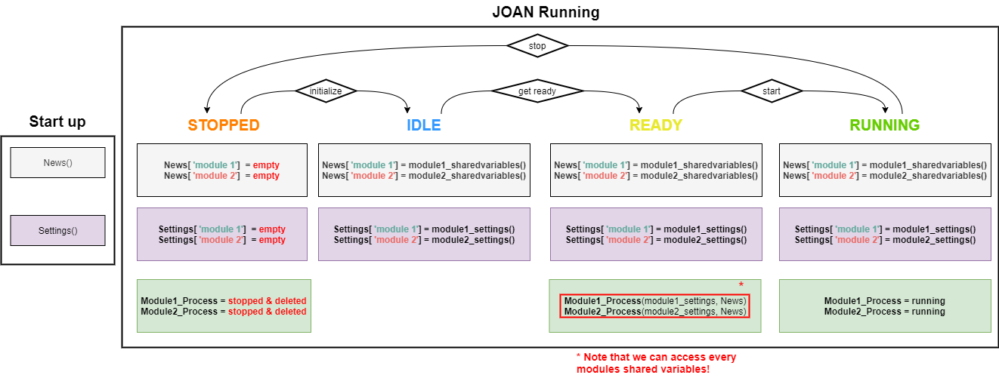

# JOAN Overview
In this section we try to explain the overall high level overview of the JOAN framework. Please note that if you are interested
in adding your own modules you need a more thorough understanding than just this section, if that is the case please
also consult the [Advanced Steps Section](advancedsteps-add-custom-module.md) for more information.

## High Level JOAN Structure

In the image above you'll notice that JOAN consists mainly of 2 groups, namely the `core` and the `modules`. For now
 we'll leave the core be, however we will go into the modules here. 

## Module
Modules can be anything you want, because 
as it says in the name already JOAN has a `Modular structure`. It is important to know what exactly is contained in a
JOAN Module, it is summarized in the image below:

## Data flow & Communication
Because of multiprocessing and the modular structure of JOAN the dataflow can be a bit difficult to grasp. In this
section we try to shed some light on these topics. A graphic overview is given in the image below, this image is an arbitrary
example where we use 2 seperate modules, `module 1` and `module 2`.

Please keep the above image in mind when going through the text below, there we will explain the flow of data and JOAN in more detail.

### States
The first thing you'll notice is that we have 4 columns of almost the same thing, these represent the different states
JOAN can be in during expected operation; `STOPPED`, `IDLE`, `READY` and `RUNNING`. This is important because it will give you more insight
into when, how and why certain communication elements are used. 

### Settings
As mentioned earlier every module has its own settings. These settings are made whenever a module is loaded and stored in the `Settings()` class. 
Loading a module means nothing more than including the module in the main.py of the program via the headquarters. Whenever you have a module loaded it will
have a settings object associated with it, this settings object can get filled with different other setting objects, for example the
hardware manager module has a base settings object for the module: `HardwareManagerSettings()`, but inside this object we have a dictionary
called `inputs` which contains the setting objects of different types of inputs. For example it can contain a 
`KeyboardSettings()` object and 2 `JoystickSettings()` objects. These specific settings objects are dynamically created and destroyed depending on the state of the module. Basically the way
it goes is as depicted below:

### Shared Variables

### Signals (maybe)

### News
The `News()` class the red thread throughout all modules, and serves as a sort of message pipe to all modules. It mainly contains the seperate `shared_variables` objects
of all the modules. This is needed because then we can access our shared variables from all modules. For example if I'd like to calculate something in a seperate
`calculator` module, and for this I need the input values of a `keyboard` from the `hardwaremanager` I can easily access this info in my new module! 

