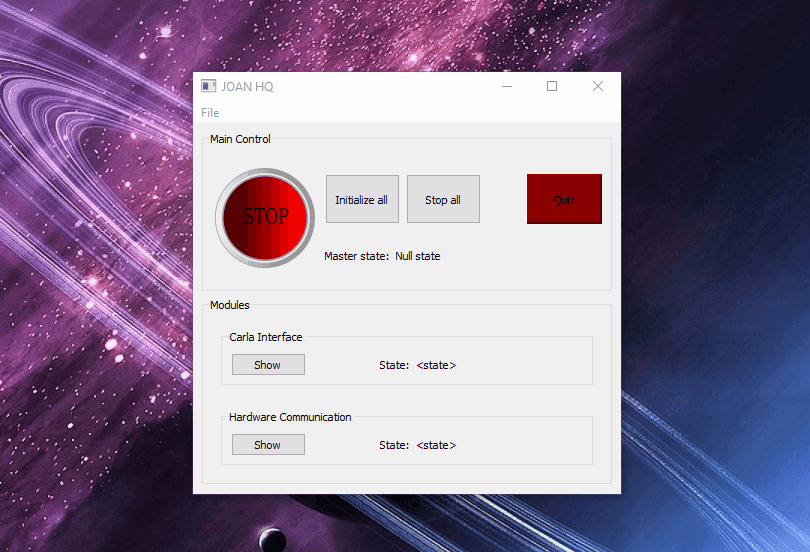

# Running JOAN and CARLA

These are the steps required from executing JOAN to driving your vehicle in CARLA. Note that with the development of JOAN, we might automate some of these steps for you.

### 1. Run JOAN and CARLA

Out-of-the-box, JOAN has a couple of modules included (for example CarlaInterface, HardwareManager, DataRecorder, SWController). These should show up in JOAN HQ, JOAN's headquarters.

- To run JOAN, either execute (in a terminal):
```
    python main.py
```
    
Make sure that your virtual environment is activated (each line should start with `(venv)`).

Or, if you use PyCharm, click the green play button or right-click on `main.py` and click on `Run main`.

- To start CARLA, open the CarlaUE4, and open your map in CarlaUE4. 

- Hit the big play button in CarlaUE4

### 2. Connect JOAN to CARLA

We need to establish a connection with CARLA before we can receive data from CARLA or send data to CARLA.

- Open CarlaInterface (click `show`) in JOAN HQ.

- Click the 'Connect' button. This will take a few seconds

### 3. Add an input device and start Hardware Manager

- Open Hardware Manager

- Click 'Add input' and select your input of choice from the drop down menu (for example, a keyboard). 

- Check the settings; you can change and save them, if you want.

- Initialize and Start the hardware manager by using the corresponding buttons

<!--  -->

### 4. Create an ego vehicle and start CARLA interface

To drive a car in CARLA, you need to create an 'ego vehicle'. You can do this in CARLA Interface.

- Click 'Add vehicle' and select 'ego vehicle' from the drop down list.

- Check all the settings of the ego vehicle.

    - In the inputs list, select the input device you just created (Keyboard)
    - Leave the steering wheel controller option blank for now
    - Select your car (the Audi is great)
    - You can select cruise control (and set your own speed)
    
- Initialize and start CARLA interface (click the button)

### 5. Drive! and collect data

If you want, you can also record data using the data recorder.

- In Data Recorder, select the data that you want to store (check/uncheck the boxes)

- Click initialize and start; you are recording!


---

We've also put this in a flow diagram:

