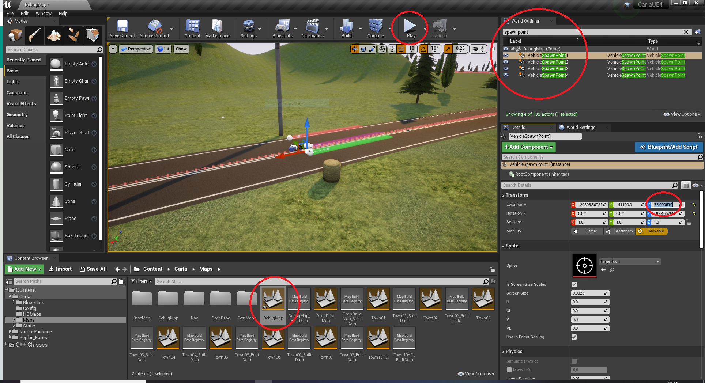

## Workflow
In this section an overview of the workflow of JOAN is presented.

!!! Note
    This document will only contain a workflow of the essential bare-bone modules (Carlainterface, Hardwaremanager) to drive a car around. This flow might change depending on your own implemented modules.

The workflow will be explained in several steps:

1. __Add modules in main.py__
2. __Start CARLA in unreal__
3. __Run Main__
4. __Setup and run HardwareManager__
5. __Setup and run AgentManager__
6. __Drive!__

### Step 1. Adding the modules in main.py
This step is easy, just add the following piece of code to the main.py file (or uncomment them):

    JOANHQACTION.add_module(JOANModules.CARLA_INTERFACE, millis=50)
    JOANHQACTION.add_module(JOANModules.HARDWARE_MANAGER, millis=5)

### Step 2. Start CARLA in unreal.
To do this select the map you'd like to drive in, the CARLA default map is town03. However (for now) the JOAN default map is 'Debugmap'. Starting the level is easy just press the play button on the top bar see the figure below:

Make sure you also have 'vehicle spawnpoints' in your level. You can check this by checking out the world content manager in the topright corner. Another note about these spawnpoints is that you should place them above the ground a bit (in this example it is 75cm, cm is the default unit in unreal) so you wont have a collision at spawning.

### Step 3. Run Main
This is the exact same step as described in __[Setup and run your JOAN project](setup-joan.md)__ at 'Running JOAN'.

### Step 4. Setup and run Hardwaremanager
To do this in the JOAN main menu show the 'Hardwaremanager' module. Now click the 'add new hardware button', this will open a selection menu in which you can choose what sort of input you'd like to add. For now only Keyboard and Joystick work. In this guide we will add a keyboard input.
So select keyboard, which will open a settings section of the keyboard. Default keys are:

* W = Throttle
* S = Brake
* A = Steer Left
* D = Steer Right
* R = Toggle Reverse
* K = Handbrake

The other settings pertain to whether the steering wheel will autocenter and how fast it does this. The sensitivities of braking and throttle can also be adjusted but we'll leave them as it is for now. These steps will look like this:

A flow-diagram is also available at the end of this page.

### Step 5. Setup and run AgentManager
Next step is to setup the Carla Interface module. This module has some built in fail safes so that you will always use the correct order. There is however an important step you should not miss to actually drive around a car which is __select your input device!!__. A short gif of setting it up is shown below:

CARLA in unreal should be running! It is also shown what kind of error you will receive if you have not got it running in unreal.

!!! Note
    In this particular version in the GIF it has been tuned in such a way that when a car is spawned the player is directly attached to it and correctly seated in the Audi R6. If this does not happen in your case you can press X on the keyboard and the player will attach to the spawned vehicle. If you are not seated in the correct position you can move around with the arrow keys and up and down with W and A. The speedometer can be moved around iwth the numpad keys 1,5,2,3 and + and -.

### Step 6. Drive!
If everything was done correctly you should now be able to drive the car with the ASDW, R and K keys. Do make sure that you clicked 'hardwaremanager' module to give it focus. Well done!

## Workflow flow diagram
The steps described above are also shown in the flowchart below:

