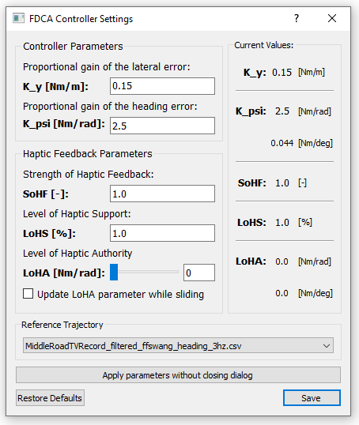
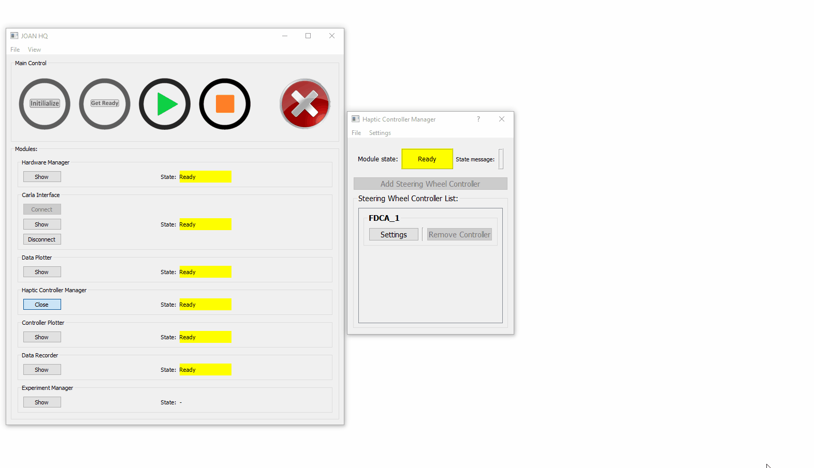

# Module: Haptic Controller Manager
The Haptic Controller Manager is a module which was specifically created to make different sort of controllers for haptic interactions. The 
example that is included is the `Four Design Choice Architecture (FDCA)` controller for haptic feedback on the steering wheel. However
the main idea behind this module is that students can make their own sort of controller for haptic feedback. In this section
we'll explain the usage of the module, which will be strikingly similar to other modules, so if you understand the basic module
architecture you should be easily able to expand on this one.

In the image below the Haptic Controller Manager module is shown how it should look like if you open it up in the STOPPED state (without default settings).

## Using the Module
Using the Haptic Controller Manger module is very similar to using the `Hardware Manager` and `Carla Interface` modules. You can add haptic controllers in the 
`stopped` state and every controller has its own settings which you have to set, for the default FDCA controller these are:

We will not go into detail here as to what these parameters mean, however there is a difference with the previously mentioned similar modules 
(`Hardware Manager` and `Carla Interface` ). The difference being that you are still able to change the settings of your controllers during the
`running` and `ready` states, this is of importance because you want to be able to tune your controllers during operation. As we show in the GIF below
we can tweak the settings during operation (click on the gif for a full sized version):

{target="_blank"}

This is the main difference with the other modules, of course you can take the FDCA controller as a template to make your own awesome
controllers! :)

## Adding to the Module
As said in the introduction adding to this module is quite similar to the other modules so please for a bit of a grasp refer to 
[adding your own agent](modules-carlainterface.md#adding_own_agents).