# Module: Hardware Manager
The HardwareManager module is quite an essential one, it does what you would expect it to do: it manages the hardware.
In the default version of the hardware manager it handles Hardware Inputs. Ofcourse you could implement any other 
code in python to link other sorts of devices to JOAN if you wish. However in this section we'l mainly focus on the 
3 main default inputs you can choose:

- Keyboard
- Joystick
- SensoDrive
 
In the image below the HardwareManager module is shown how it should look like if you open it up in the 
`STOPPED` state. (without default settings)

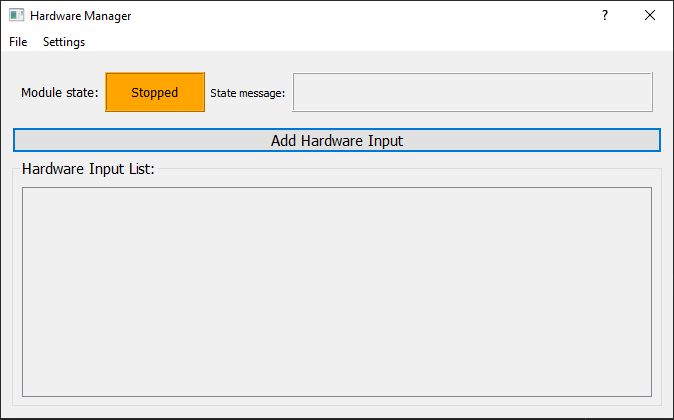

## Using the Module
Using the module is quite similar to using other 'core' modules of JOAN. You can add/remove devices in the `STOPPED` 
state only. This will open up a dialog in which you can choose which input you want to add, which will then pop up in the 
hardware list, see the pictures below:

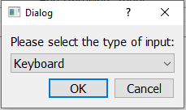
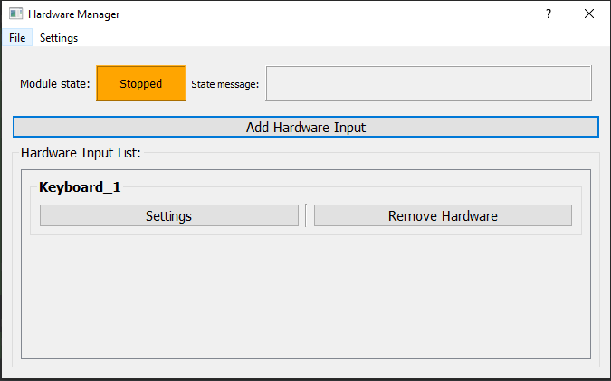

As mentioned earlier there are (by default) 3 input types you can choose from, in the sections below we'll go into more 
detail for each of them.

### Keyboards
Whenever adding a keyboard it will automatically open up the keyboard settings dialog (if you do it from the `add hardware input` button):

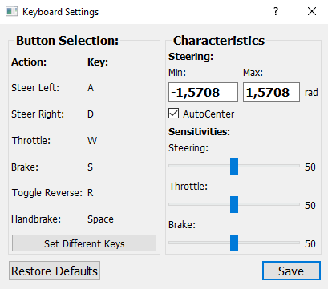

The settings in the dialog are quite self explanatory, besides maybe the `sensitivities` section. The higher
a sensitivity the faster it will react to you pushing the appropriate button.
You can set different keys by pressing the `Set Different Keys` button, the button you can change will then
light up green, see the GIF below:

!!! Note
    If you try to select the same button twice for a different function you will get notified of doing so. You will be able 
    continue, however it can lead to erratic behaviour.

### Joysticks
The second input you can choose from by default is the `Joystick` input. 

!!! Note 
    The nomenclature `Joystick` may be a bit confusing  since it does not necessarily need to be an actual joystick as 
    you would expect from for example flight simulator. A `Joystick` in JOAN constitutes nothing more than a HID 
    (Human Interface Device). For example, steering wheels by thrustmaster or logitech are also 'Joysticks'.

Whenever adding a Joystick device it will automatically open up the joystick settings dialog (if you do it from the `add hardware input` button):

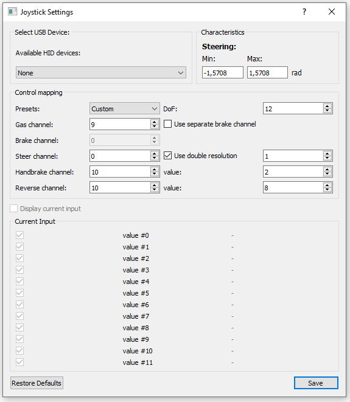

In here the first thing you do is find your plugged in USB device in the list of `available HID devices`. In this example 
we have a Xbox Controller connected and will try and preview the inputs. Also notice that there are presets available for
both Xbox and PlayStation controllers.

[ 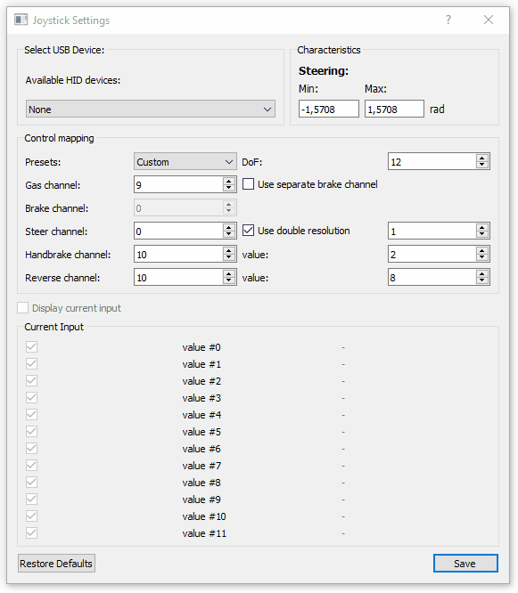 ](gifs/modules-hardwaremanager-joysticksettings.gif)

Now if you have a Logitech Steering Wheel or for example some other sort of HID device which is not an Xbox or PlayStation controller
you will have to check which channel does what. So for example if you turn the steering wheel and see that both value #01 and value #02 
are changing, you'll have to put the steering to channel 1 and 2 with a double resolution. This will take some trial and error
but once you have your settings completed you can save them and re-use them. :)

!!! Important
    There is a bug where if you are using a newer generation Xbox one controller it will not work with JOAN, this is due to the fact that
    windows blocks any input from the controller if it is not used in the active process. And since we use multiprocessing this is 
    impossible to guarantee. The fix for this is using the `X-Input` library, which is still on our list. For now, it will just not work
    with the later generation Xbox controllers :(.

### SensoDrives
This section is mainly important for TUD students who will have access to a SensoDrive wheel. Firstly, when you add a `sensodrive` as input 
via the `add hardware input` button it will open up the settings dialog:

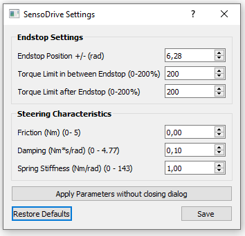

The `Endstop Position` mean at which turning of the wheel it will simulate a wall, it will be very hard to go through this point. Note that
it is not possible to create unsymmetric endstops. 6.28 Radians means it will have an endstop at -360 degrees and 360 degrees.
The `Torque Limit` settings should just be kept at 200%, which is the maximum, you can lower these values for safety reasons.
The steering characteristics are something more important, this will determine the way your steering will feel. The default 
settings are okay to start with.

Now the second thing you will notice when you add a SensoDrive is that the `hardware tab` which is added to the `Hardware Manager Dialog` is a bit
different than the ones for Joysticks and Keyboards, It contains extra buttons and a `state` label:

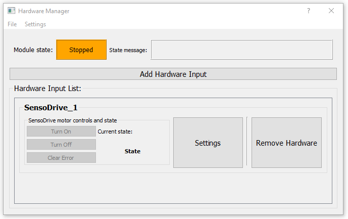

The SensoDrive can in be 1 of three states:

- On (green)
- Off (orange)
- Error (red)

Depending on the state of the SensoDrive you can click the buttons. So if its off, you can turn it on, on to off and you can clear the error if it is in 
error:

SensoDrive in the `off` state:
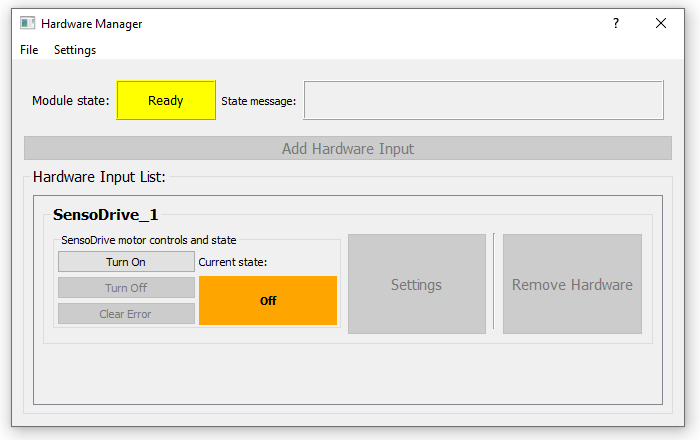

SensoDrive in the `on` state:
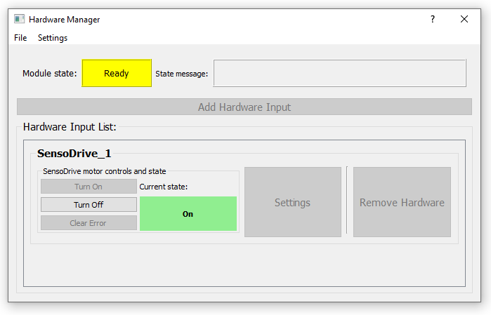

SensoDrive in the `error` state:
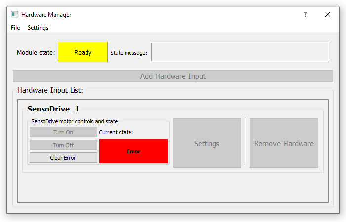

!!! Note 
    You can use these buttons in both the `ready` and `running` states. For more information on the exact workings of a SensoDrive please
    take a look at the [SensoDrive Explanation section](other-sensodrive.md)

## Adding to the Module
If there is any sort of input device or hardware you'd like to add to JOAN ofcourse you can! The method
of doing so is greatly similar to the adding of your own agents described in
[adding your own agent](modules-carlainterface.md#adding_own_agents), please use the same methodology.